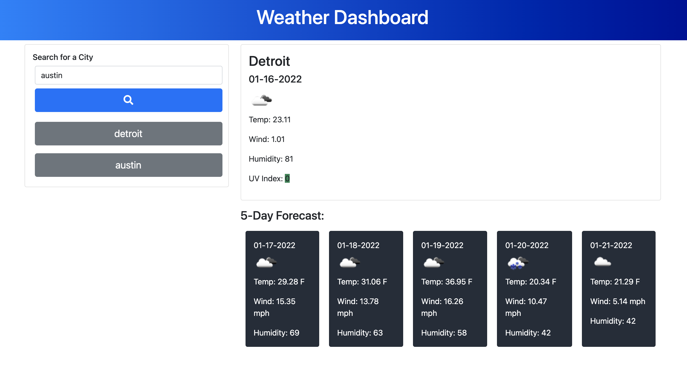

# WeatherDan

WeatherDan is your digital weatherman.

This web application is built on HTML5, with Bootstrap, JavaScript, JQuery, and FontAwesome. 

Here is a screenshot

## What does it do?
Search any city it the top left corner, it returns current conditions with temp, wind, humidity, and uv index. The background color of the UV index reading changes green, yellow, or red depending on the level of UV intensity.

A 5-day forecast is also presented with temp, wind speed, and humidity. 

WeatherDan leverages openweathermap.org for API forecast information. You can find documentation [here](http://openweathermap.org/)

### Who is WeatherDan?
WeatherDan was built by [Dan Evola](http://dmevola.github.io/portfolio/), who was once a real life college news weatherman for a semester or two. 